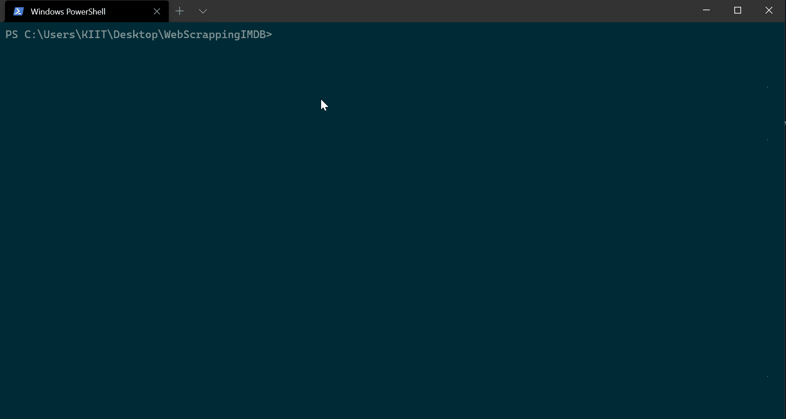

# WebScraping CLI

[](https://GitHub.com/Naereen/StrapDown.js/graphs/commit-activity "Repo Maintained")
[](https://GitHub.com/akashchouhan16/ "github.com/akashchouhan16")
[](https://code.visualstudio.com/ "VSCODE")
[](https://github.com/akashchouhan16/WebScraping-CLI/issues)
[](https://github.com/akashchouhan16/WebScraping-CLI/stargazers) 

<!-- [](https://forthebadge.com) -->

- This is a command line tool built using [Nodejs](https://nodejs.dev/learn) and the Google's Node library [Puppeteer](https://developers.google.com/web/tools/puppeteer).
- Provides a high-level API to control headless Chrome or Chromium over the DevTools Protocol.
- It can also be configured to use full (non-headless) Chrome or Chromium.

NOTE : **The cli takes **IMDb URI**, validates it and then scrapes contents to displays it in the output table.**

> **Checkout the previews [here](./previews).**

---

## How to run?

- **Install dependencies**
  ```bash
      npm install
  ```
  **OR**
  ```
      npm i --save
  ```
- **Run the Script**
  ```bash
   npm run start
  ```

---

## Preview

> 

---

## [Application Info](https://github.com/akashchouhan16/WebScraping-CLI "Web Scraping CLI")

[](https://forthebadge.com)
[](https://forthebadge.com)

### Version

**[1.0.3](https://github.com/akashchouhan16/WebScraping-CLI#readme, "Web Scraping CLI v1.0.3")**

### Licence

**[MIT](https://github.com/akashchouhan16/WebScraping-CLI/blob/master/LICENSE.md, "View LICENSE")**
